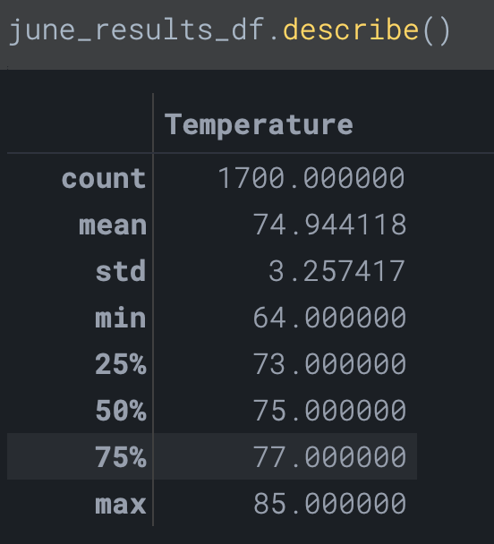
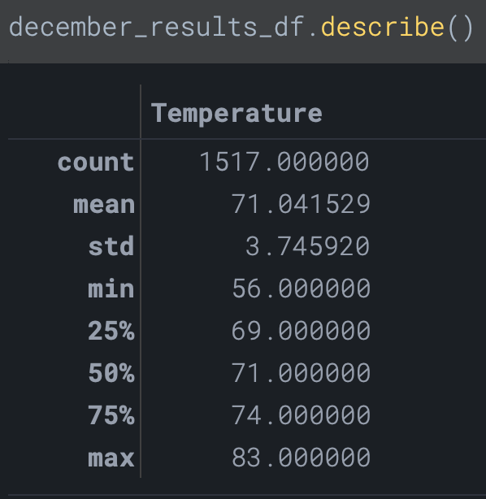

# 09-Weather-Analysis-lukeperrin
Module 9 Challenge: weather analysis with Flask and data storage and retrieval using SQLite and sqlalchemy

## Overview

This challenge seeks to analyze weather trends in Hawaii to build an argument for investing in a surfboard and icecream store. The purpose of this analysis is to look at weather trends in Hawaii throughout the year to anticipate business fluctuation throughout the year.

## Results

The following results were obtained by analyzing temperatures during the months of June and December:

- The average temperature in June is 74.9 ± 3.3°F. The average temperature in December is 71.0 ± 3.7°F. The difference between does not indicate that the weather would impact business between these two months.
- The minimum temperature in June is 64°F, whereas in December the minimum temperature is 56°F. Depending on when these temperatures occurred, there may be some reduced business during these colder December temperatures.
- Considering the quartiles vary only by an average of 2°F in June and by an average of 3°F, it is not likely that either of these months experience much fluctuation in temperature from the average. This would imply that business would be sustained between these two seasons.

## Summary

The data analyzed above seems to suggest that there would not be significant impact on business caused by the weather between June and December. The temperatures between the months of June and December remain quite mild and fluctuate very little from their averages.

The following additional queries and analyses could be performed to further investigate the weather’s ability to potentially impact business:

1. A query that reviews the precipitation between the two months to investigate potential business impact caused by rain.
2. A query that looks into temperature fluctuations throughout the day (specifically, throughout anticipate business hours) to assess the relevence of temperature fluctuations during this window.

